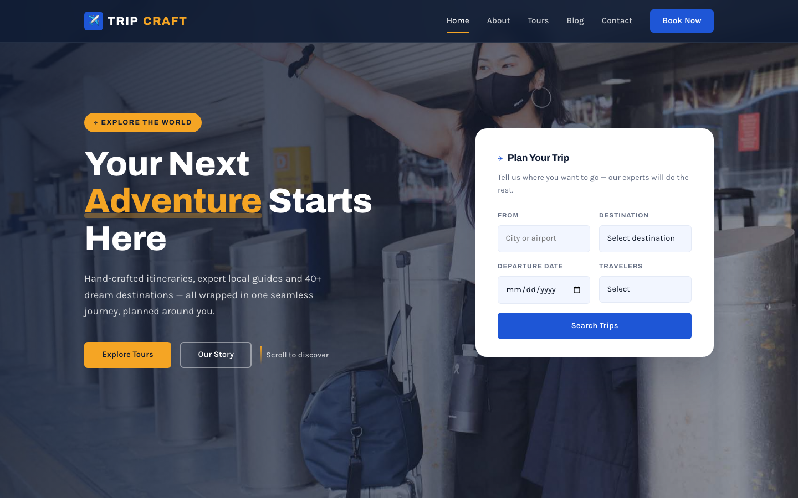

# ✈️ TRIPCRAFT — Travel Agency Template

A premium, framework-free HTML template for travel agencies and tour operators. The design pairs a royal blue + amber palette with bold Archivo headings and clean Karla body text, anchored by a full-bleed crossfading hero with a floating booking card — an identity built for adventure, trust and effortless trip planning.

## 📸 Screenshot

## 🎨 Design System

| Token | Value | Usage |
|-------|-------|-------|
| `--royal` | `#1E56D6` | Primary — buttons, links, active states |
| `--amber` | `#F5A524` | Accent — CTAs, badges, highlights, stat numbers |
| `--navy` | `#0F1B33` | Headings, footer, hero overlay, dark sections |
| `--sky` | `#F2F6FF` | Light blue-tinted page background |
| `--card` | `#FFFFFF` | Cards, floating booking panel, form fields |
| `--ink` | `#101828` | Body text |
| `--muted` | `#667085` | Secondary text, meta info |
| `--line` | `#E4EAF6` | Borders, dividers |
| Headings | Archivo | Bold geometric grotesque (500–800) |
| Body | Karla | Friendly, readable humanist sans |

## 📄 Pages

| Page | Description | Sections |
|------|-------------|----------|
| [index.html](index.html) | Home — full-bleed crossfade hero with floating booking card | Popular tours (3), Why-us icon features, About split with layered images, Destinations strip, Testimonial, Newsletter band |
| [about.html](about.html) | Our story | Story split with layered images, Stats bar, Values cards, CTA |
| [services.html](services.html) | Tour packages & pricing | Photo page-hero, 6 tour-package cards, Add-ons list, CTA |
| [blog.html](blog.html) | Travel journal | Photo page-hero, 3 blog cards, CTA |
| [contact.html](contact.html) | Booking & enquiry | Photo page-hero, Enquiry form (name, email, phone, trip, dates, travelers, message), Contact card with hours, CTA |

## ⚙️ Tech Stack

- **HTML5** — semantic markup, accessibility-first
- **CSS3** — custom properties, Grid, Flexbox, `clamp()`, `aspect-ratio`
- **Vanilla JS** — IntersectionObserver, hero crossfade, mobile nav, form validation
- **Fonts** — Google Fonts (Archivo + Karla)

## 📁 Images

All images from the original travel template — 10 files in `assets/img/`:

- `carousel-1.jpg` through `carousel-3.jpg` — Hero crossfade (1920×1080)
- `breadcrumb-bg.jpg` — Interior page-hero banner (1920×675)
- `subscribe-img.jpg` — Newsletter band background (1920×1080)
- `about-img.jpg`, `about-img-1.png` — Layered about split (600×700 / 462×540)
- `blog-1.jpg` through `blog-3.jpg` — Tour & blog cards (500×400)

---

**Template by uiuxlabz** — framework-free, responsive, production-ready.

---

### Let's Build Something Together 🚀

[https://tally.so/r/q4q1L9](https://tally.so/r/q4q1L9)
